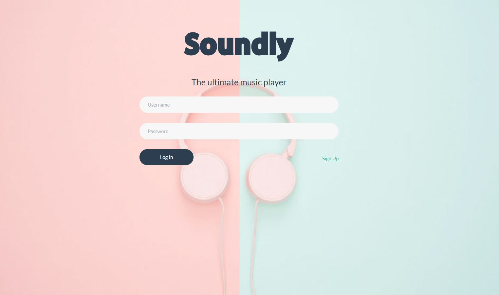
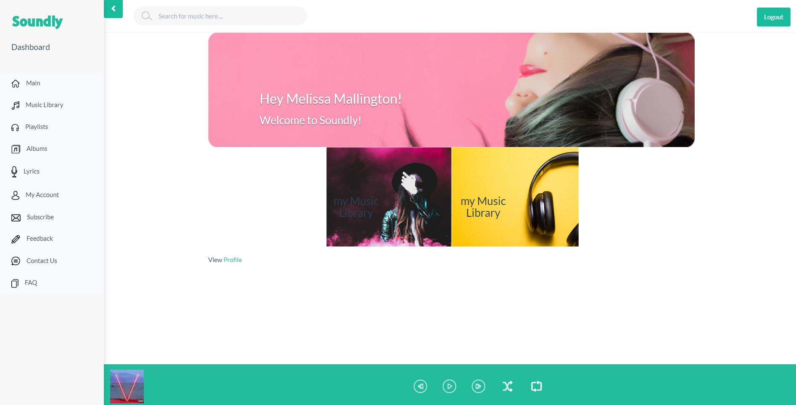

# Soundly
A music web application where user will be able to listen to music with admin interface.
This is a group academic project focus to understand PHP.

Live Demo: http://soundly.mdmazo.com/
## Login Sample Details
    - Username: test1
    - Pass: test1

### Members: 
- MarL Mazo
- Shanakay Hall
- Elmira Alif
- Harpreet Gill
## Technologies
- PHP (Main Focus)
- HTML5/CSS
- BootStrap
- JavaScript
- JQuery

## MarL Mazo
My Features I created are as follows: 
1. ### Music Library Feature
      - [x] Css complete
      - [x] Integrated the Database, Model Song and Model Artist
      - [x] Play music in User View
      - [x] CRUD Song    
      - [x] CRUD Artist        
      - [x] Admin List Pagination
      - [x] Admin List Search Functionality
      - [x] Admin List Sort by Functionality
      - [x] Error Handling Form    
2. ### User Controls/Music Playback - Footer Area 
      - [x] Css complete
      - [x] Integrated the Database
      - [x] Created Handlers to get data thru php and show it in the music playback area
      - [x] Update Text in Playback Area
      - [x] Pause Song
      - [x] Play Song
      - [x] Play Next Song, Automatic Next Song once song is finished
      - [x] Play Previous Song
3. ### Frequently Ask Questions 
      - [x] Css complete
      - [x] Integrated the Database, Model Faq
      - [x] Created Handler to be use for autocomplete searching in the user view 
      - [x] Ajax Implementation Auto Complete Search   
      - [x] CRUD Faq        
      - [x] Admin List Pagination
      - [x] Admin List Search Functionality
      - [x] Admin List Sort by Functionality
      - [x] Error Handling Form
